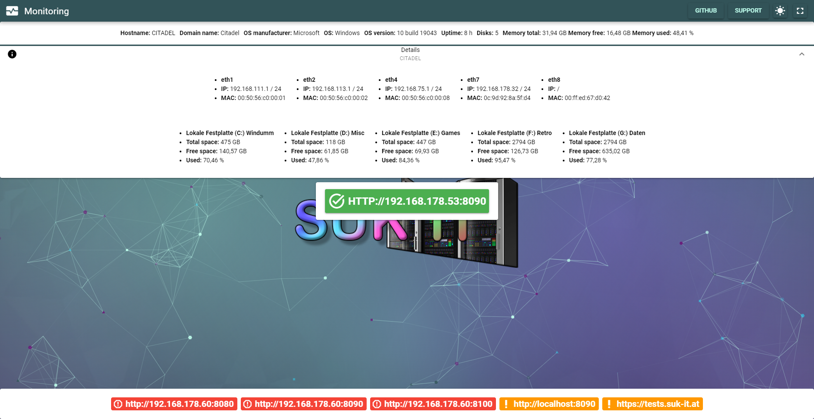
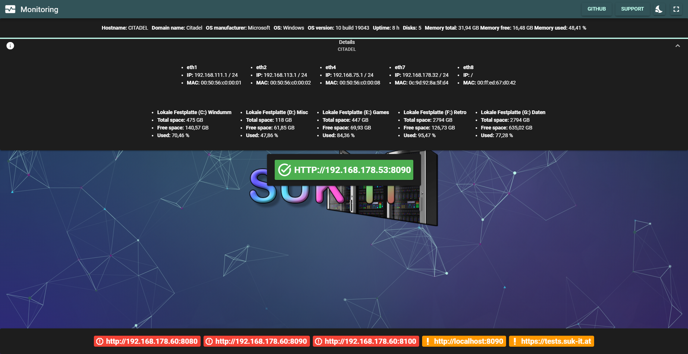
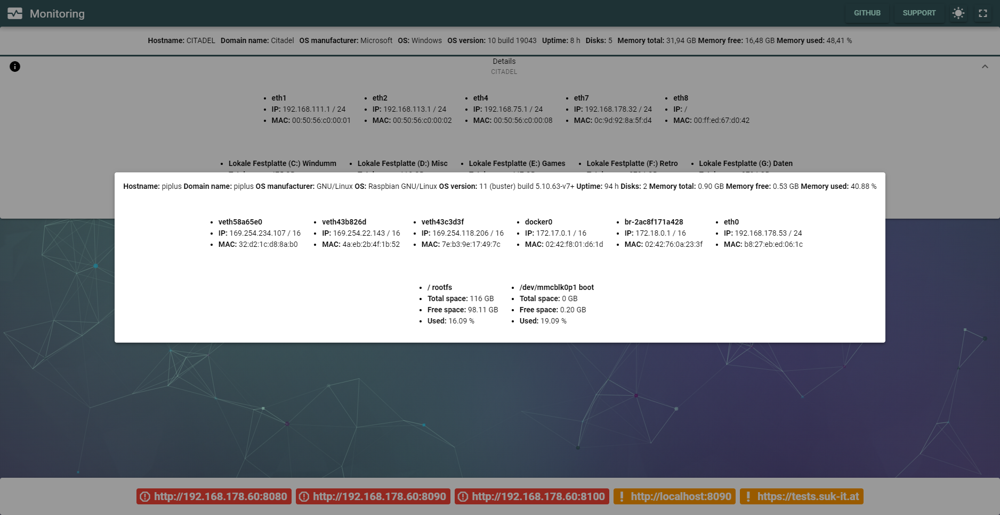
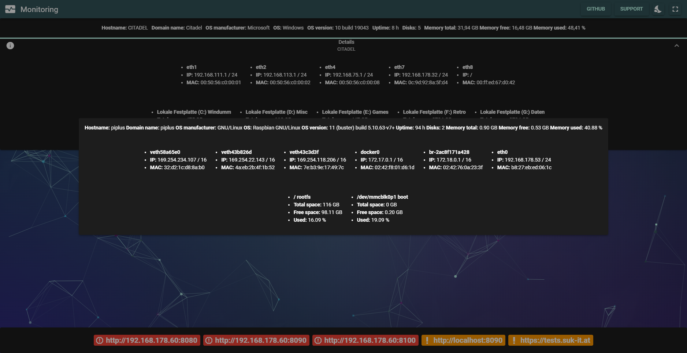

# Monitoring

##### A small amateur-ish Java program making use of the Spring Boot and Quasar frameworks to provide a webinterface to monitor the host as well as any configured agent.

| Light mode                                    | Dark mode                                   |
|-----------------------------------------------|---------------------------------------------|
|              |              |
|    |    |
|  |  |

**All IPs and infos in these screenshots are test instances or VMs which got disposed of after these tests, so the information displayed in these screenshots is useless to you ;)**

# About Monitoring

You can:
- Configure multiple agents to monitor. Formatting is `<address:port>,123456;<address2:port>,123456` etc.
- Configure a smtp server through which to send email notifications in case of
    - A disk drive reaching critical usage (configurable through `de.griefed.monitoring.schedule.email.notification.disk.usage` in %)
    - CPU processes exceeding a certain amount (configurable through `de.griefed.monitoring.schedule.email.notification.cpu.processes`)
    - Memory reaching critical usage (configurable through `de.griefed.monitoring.schedule.email.notification.memory.usage` in %)
    - Cronjobs for these can be configured via
        - `de.griefed.monitoring.schedule.email.notification.disk` for disk usage notifications
        - `de.griefed.monitoring.schedule.email.notification.cpu` for cpu processes amount notifications
        - `de.griefed.monitoring.schedule.email.notification.memory` for memory usage notifications
- Configure a set of ports used for scanning for host availability
    - These take affect if a simple ping of the configured agent fails, which may be due to several reasons. So, if you know your server won't respond to a simple ping, you can set the ports of which you know you will get an answer from.
The program itself is fully configurable through the `application.properties` file.
    - The connect and read timeouts can be configured through `de.griefed.monitoring.timeout.connect` and `de.griefed.monitoring.timeout.read` respectively 
- To configure Monitoring to run as an agent, set `de.griefed.monitoring.agent` to `true`
- Should you wish to change the port Monitoring runs on, change `server.port` to a port of your choice
- The cronjob at which agents are polled by a given monitor is configured via `de.griefed.monitoring.schedule.agents` 
- The cronjob at which the monitor itself updates its information is configured via `de.griefed.monitoring.schedule.update`
- To view information about an agent, simply click the relevant green button
    - Please be aware that whilst you are viewing any agents details, the refreshing of the data is paused. To resume automatic updates, click anywhere to close the dialog :) 

# Default configuration

Default values are: 

```properties
# suppress inspection "SpringBootApplicationProperties" for whole file
server.port=8080
server.error.whitelabel.enabled=false
server.tomcat.basedir=.
server.tomcat.accesslog.enabled=true
server.tomcat.accesslog.directory=logs
server.tomcat.accesslog.file-date-format=_yyyy-MM-dd
server.tomcat.accesslog.prefix=tomcat_access
server.tomcat.accesslog.suffix=.log
server.tomcat.accesslog.pattern=common
spring.output.ansi.enabled=ALWAYS
server.error.include-message=ALWAYS
server.error.include-stacktrace=ALWAYS
spring.application.name=Monitoring
de.griefed.monitoring.agent=false
de.griefed.monitoring.agents=http://127.0.0.1:8080,123456789
de.griefed.monitoring.scan.ports=22,80,443,8080
de.griefed.monitoring.timeout.connect=3
de.griefed.monitoring.timeout.read=3
# To disable a cronjob, set it to -
de.griefed.monitoring.schedule.agents=0 */5 * * * *
de.griefed.monitoring.schedule.update=30 * * * * *
de.griefed.monitoring.schedule.email.notification.cpu=0 */5 * * * *
de.griefed.monitoring.schedule.email.notification.cpu.processes=500
de.griefed.monitoring.schedule.email.notification.disk=0 */5 * * * *
de.griefed.monitoring.schedule.email.notification.disk.usage=90.00
de.griefed.monitoring.schedule.email.notification.memory=0 */5 * * * *
de.griefed.monitoring.schedule.email.notification.memory.usage=90.00
de.griefed.monitoring.polling=5000
# To leave emailing disabled, do not edit the mail.* properties
mail.smtp.starttls.enable=true
mail.smtp.auth=true
mail.smtp.host=smtp.example.com
mail.smtp.port=587
mail.recipients=example@example.com
mail.from=monitoring@example.com
mail.user=example@example.com
mail.password=123456
```

# Deploying Monitoring

## Docker

```yaml
version: '3'
services:
  monitoring:
    image: ghcr.io/suk-it/monitoring:latest
    container_name: monitoring
    restart: unless-stopped
    environment:
      - TZ=Europe/Berlin
      - PUID=1000
      - PGID=1000
    volumes:
      - ./monitoring/config:/config
    ports:
      - 8080:8080
```

After the container is created and started, it will generate all default files in `./monitoring/config` (unless you changed it). In order to customize the behaviour of Monitoring, first stop the container with `docker stop monitoring`, then
edit the `application.properties`-file, or any other file you wish to change, in `./monitoring/config` (unless you changed it), and run `docker start monitoring` again. Done!

## Using the jar

Download the latest jar-file from the releases-page and execute it with `java -jar Monitoring.jar`. This will generate all default files and most importantly, the `application.properties` file.
If you wish to customize this file, you need to quit Monitoring, make your changes to the `application.properties` and then start Monitoring again. Done!